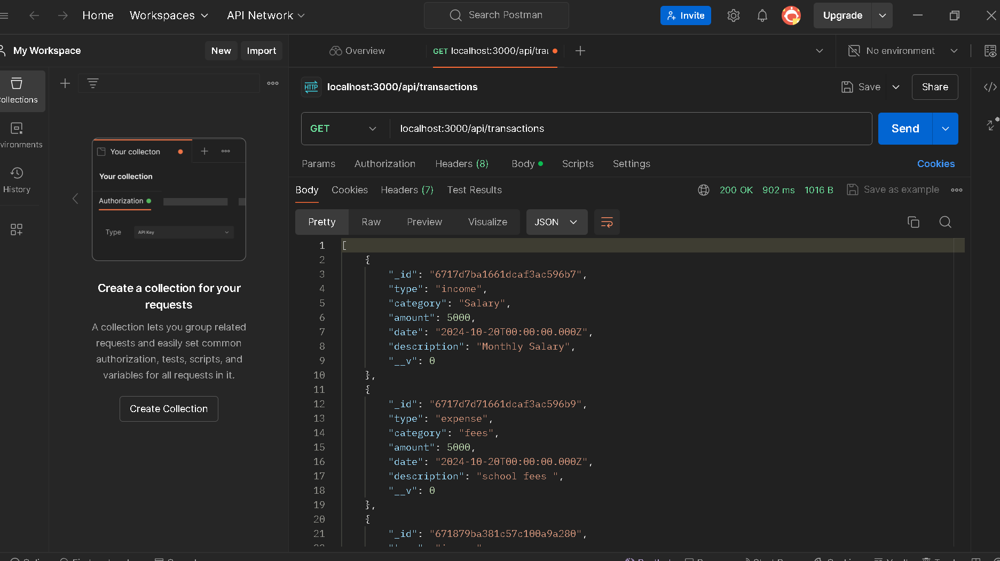
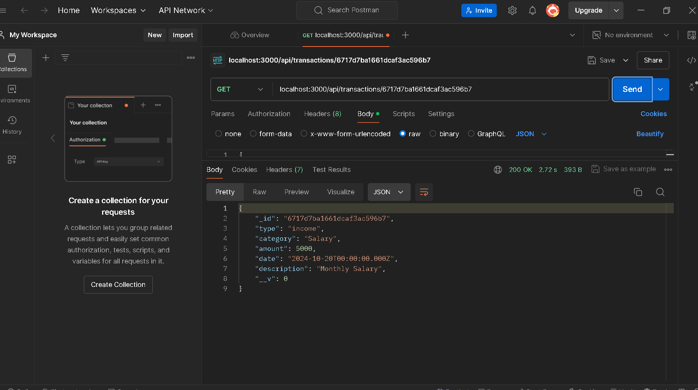
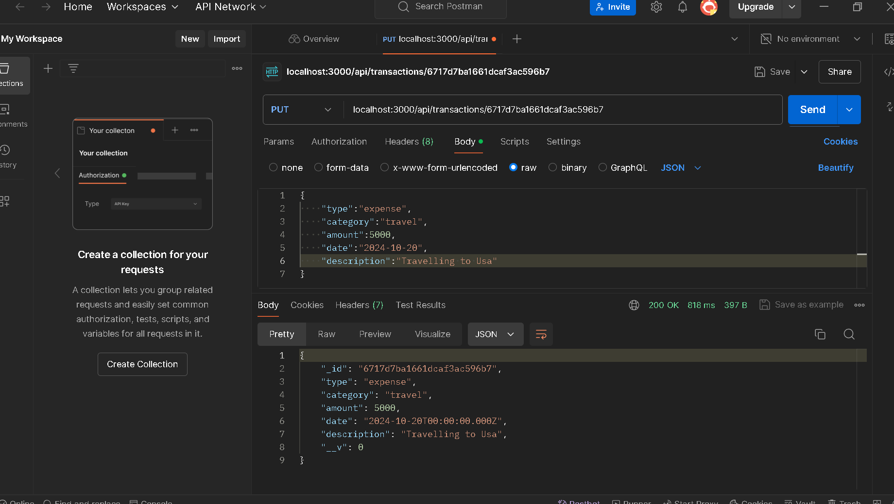
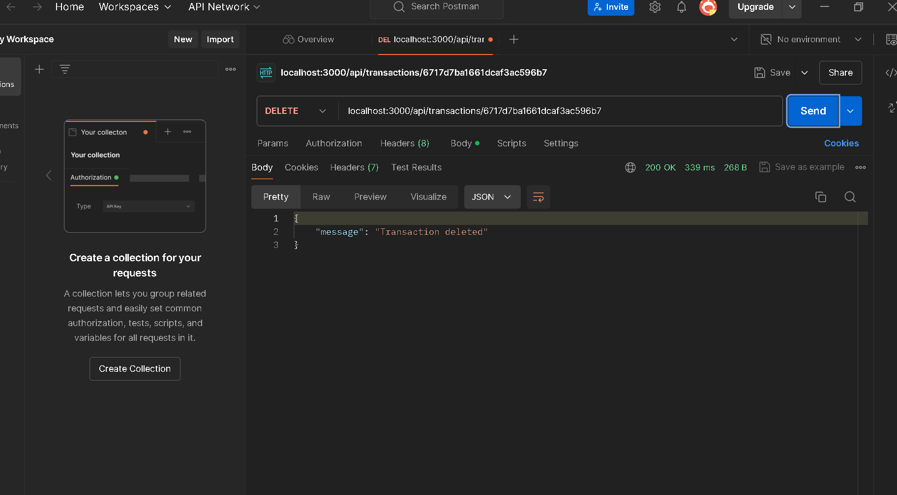
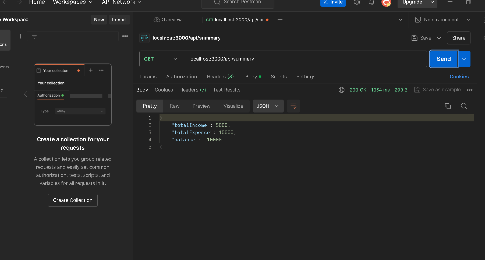

# Transactions API

This project is a simple RESTful API built with **Express.js** and **MongoDB**. The API provides functionalities for managing financial transactions such as adding new transactions, retrieving all transactions or a single transaction, updating, deleting, and generating a summary of the transactions.

## Table of Contents

1. [Features](#features)
2. [Installation](#installation)
3. [API Endpoints](#api-endpoints)
   - [Add Transaction](#post-transactions)
   - [Retrieve All Transactions](#get-transactions)
   - [Retrieve Single Transaction](#get-transaction-id)
   - [Update Transaction](#put-transaction-id)
   - [Delete Transaction](#delete-transaction-id)
   - [Transaction Summary](#get-summary)
4. [Screenshots](#screenshots)
5. [Technologies Used](#technologies-used)
6. [License](#license)

## Features

- **CRUD Operations**: Create, Read, Update, and Delete transactions.
- **Transaction Summary**: Summarize total income, expenses, and calculate the balance.
- **Error Handling**: Appropriate status codes and error messages for various scenarios (e.g., invalid ID, missing transaction).

## Installation

Follow the steps below to install and run the project:

1. **Clone the repository**:

   ```bash
   git clone https://github.com/your-username/transactions-api.git
   ```

2. **Navigate to the project folder**:

   ```bash
   cd transactions-api
   ```

3. **Install dependencies**:

   Make sure you have [Node.js](https://nodejs.org/) installed. Then, install the required dependencies by running:

   ```bash
   npm install
   ```

4. **Set up the environment variables**:

   Create a `.env` file in the root directory of your project and add the following:

   ```plaintext
   MONGODB_URI=<your-mongodb-uri>
   ```

5. **Run the server**:

   Start the Express server using the following command:

   ```bash
   npm start
   ```

6. **Access the API**:

   The API will be running at:

   ```plaintext
   http://localhost:3000
   ```

## API Endpoints

### POST `/api/transactions`

**Description**: Add a new transaction (income or expense).

**Request Body**:

```json
{
  "type": "income", // or "expense"
  "category": "Salary",
  "amount": 1000,
  "date": "2024-01-01",
  "description": "January Salary"
}
```

**Response**:

- `201 Created`: The new transaction is successfully added.
- `400 Bad Request`: Invalid input or missing fields.

**Example**:

```bash
curl -X POST http://localhost:3000/api/transactions   -H "Content-Type: application/json"   -d '{"type": "income", "category": "Salary", "amount": 1000, "date": "2024-01-01", "description": "January Salary"}'
```

### GET `/api/transactions`

**Description**: Retrieve all transactions.

**Response**:

- `200 OK`: A list of all transactions.
- `500 Internal Server Error`: Failed to retrieve transactions.

**Example**:

```bash
curl -X GET http://localhost:3000/api/transactions
```

### GET `/api/transactions/:id`

**Description**: Retrieve a single transaction by its ID.

**Response**:

- `200 OK`: The transaction is successfully retrieved.
- `404 Not Found`: Transaction with the specified ID does not exist.
- `500 Internal Server Error`: Failed to retrieve the transaction.

**Example**:

```bash
curl -X GET http://localhost:3000/api/transactions/transactionId
```

### PUT `/api/transactions/:id`

**Description**: Update an existing transaction by its ID.

**Request Body**:

```json
{
  "type": "expense",
  "category": "Food",
  "amount": 50,
  "date": "2024-01-05",
  "description": "Groceries"
}
```

**Response**:

- `200 OK`: The transaction is successfully updated.
- `404 Not Found`: Transaction with the specified ID does not exist.
- `400 Bad Request`: Invalid data or transaction ID.

**Example**:

```bash
curl -X PUT http://localhost:3000/api/transactions/transactionId   -H "Content-Type: application/json"   -d '{"type": "expense", "category": "Food", "amount": 50, "date": "2024-01-05", "description": "Groceries"}'
```

### DELETE `/api/transactions/:id`

**Description**: Delete a transaction by its ID.

**Response**:

- `200 OK`: The transaction is successfully deleted.
- `404 Not Found`: Transaction with the specified ID does not exist.
- `500 Internal Server Error`: Failed to delete the transaction.

**Example**:

```bash
curl -X DELETE http://localhost:3000/api/transactions/transactionId
```

### GET `/api/summary`

**Description**: Get a summary of total income, total expenses, and balance.

**Response**:

- `200 OK`: A summary of all transactions.
- `500 Internal Server Error`: Failed to generate the summary.

**Example**:

```bash
curl -X GET http://localhost:3000/api/summary
```

**Response Example**:

```json
{
  "totalIncome": 5000,
  "totalExpense": 2000,
  "balance": 3000
}
```

## Screenshots

### 1. Adding a New Transaction


### 2. Retrieving All Transactions


### 3. Retrieving Transaction with Id


### 4. Updating Transaction with Id


### 5. Delete Transaction with Id



### 6. Transaction Summary


## Technologies Used

- **Node.js**: JavaScript runtime environment.
- **Express.js**: Web framework for Node.js.
- **MongoDB**: NoSQL database used to store transactions.
- **Mongoose**: Object Data Modeling (ODM) library for MongoDB and Node.js.
- **dotenv**: Loads environment variables from `.env` file.

